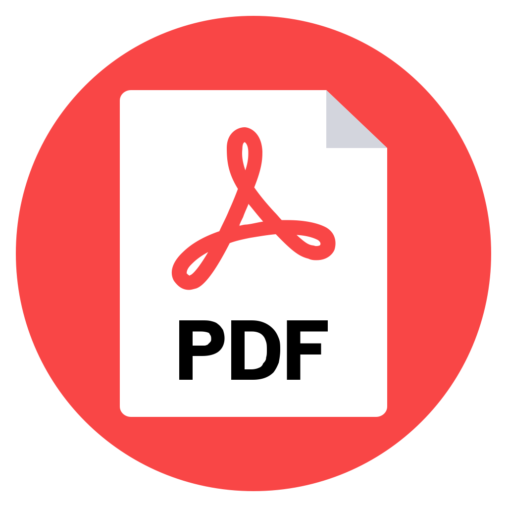

<p align="center">
    <a href="https://github.com/paulocoutinhox/pdfium-lib" target="_blank" rel="noopener noreferrer">
        
    </a>
</p>

<h1 align="center">PDFium Library</h1>

<p align="center">
  <a href="https://github.com/paulocoutinhox/pdfium-lib/actions/workflows/ios.yml"></a>
  <a href="https://github.com/paulocoutinhox/pdfium-lib/actions/workflows/macos.yml"></a>
  <a href="https://github.com/paulocoutinhox/pdfium-lib/actions/workflows/android.yml"></a>
  <a href="https://github.com/paulocoutinhox/pdfium-lib/actions/workflows/wasm.yml"></a>
  <a href="https://github.com/paulocoutinhox/pdfium-lib/actions/workflows/windows.yml"></a>
</p>

<p align="center">
Project to compile cross-platform PDFium library from locally reproducible scripts.
</p>

<br>

## Platforms

This project currently compiles to these platforms:

- [x] iOS device (arm64)
- [x] iOS simulator (x86_64, arm64)
- [X] Android (armv7, armv8, x86, x86_64)
- [x] macOS (x86_64, arm64)
- [x] WASM (Web Assembly)
- [x] Windows

Platforms in roadmap:

- Linux

Obs: PDFium project is from Google and i only patch it to compile to all platforms above. Check all oficial details and PDFium license here:

https://pdfium.googlesource.com/

## Web demo

Since this project generate WASM version, i published a demo that you can test PDFium direct on web browser here:

https://pdfviewer.github.io

Or with a public PDF as parameter:

https://pdfviewer.github.io/?title=Demo%20PDF%20with%201MB&url=https://raw.githubusercontent.com/mozilla/pdf.js-sample-files/master/tracemonkey.pdf

## Requirements

1. Ninja Build
2. Python 3
3. PIP

Obs: Generally Python 3 already come with PIP installed. Check it with command `python3 -m pip --version`.

## How to compile

These are the `general` steps that need be executed `before all` others platforms steps.

1. Get the source:

```
git clone https://github.com/paulocoutinhox/pdfium-lib.git
cd pdfium-lib
```

2. Install PIP requirements:

```
python3 -m pip install -r requirements.txt
```

3. Get Google Depot Tools:

```
python3 make.py build-depot-tools
export PATH=$PATH:$PWD/build/depot-tools
```

Obs:

- The file `make.py` need be executed with Python version 3.
- These steps you only need make `one` time.
- If you change `pdfium` git commit revision, edit file `modules/config.py` and execute `step 4`.

## How to compile for iOS

Check tutorial here: [Build for iOS](docs/BUILD_IOS.md)

## How to compile for macOS (with Apple Silicon - M1)

Check tutorial here: [Build for macOS](docs/BUILD_MACOS.md)

## How to compile for Android

Check tutorial here: [Build for Android](docs/BUILD_ANDROID.md)

## How to compile for WASM

Check tutorial here: [Build for WASM](docs/BUILD_WASM.md)

## Prebuilt binary

Access releases page to download prebuilt binaries:

https://github.com/paulocoutinhox/pdfium-lib/releases

## How to include files and extend pdfium

Check tutorial here: [How to include files](docs/HOW_TO_INCLUDE_FILES.md)

## Buy me a coffee

Support the continuous development of this project.

<a href='https://ko-fi.com/paulocoutinho' target='_blank'></a>

## My other projects

- XPLPC - Cross Platform Lite Procedure Call: [https://github.com/xplpc/xplpc](https://github.com/xplpc/xplpc)
- Nativium - C++ Multiplatform Modular Toolkit Template: [https://github.com/nativium/nativium](https://github.com/nativium/nativium)

## License

This license informations is about this personal project, not the Google PDFium Library.

[MIT](http://opensource.org/licenses/MIT)

Copyright (c) 2018-2023, Paulo Coutinho
